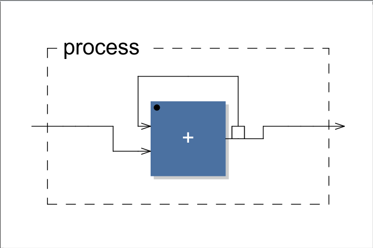
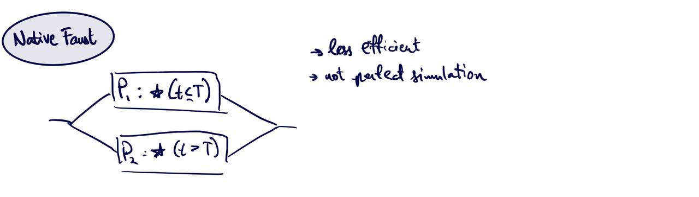
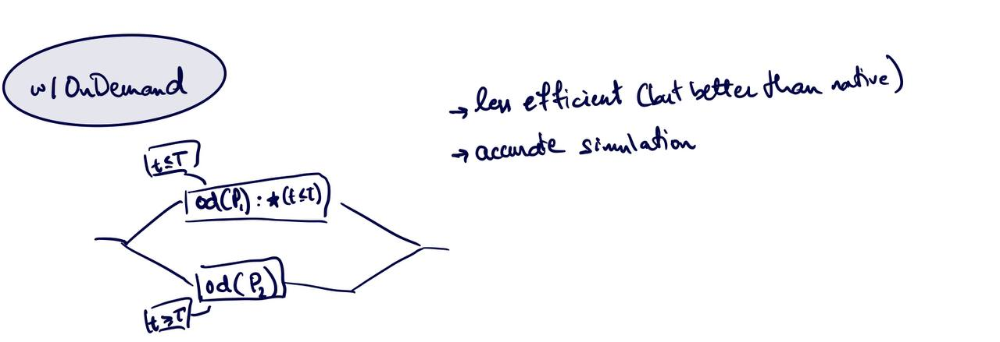

# Ondemand(od): Faust's new reactive primitive

### What does the new ondemand primitive offer/solve?

The ondemand (od) primitive presents us with a way of triggering certain computations/functions with a clock signal. Previously, Faust had no means of distinguishing which computations to process, and thus computed them all, for every sample, regardless of the program output. Computations that did not reach/affect the output signal were by default simply multiplied by zero. However, with the new ondemand primitive, computation blocks can now be paired with a binary clock signal that acts as a computation trigger. Depending on the trigger clock signal, the resulting computation is downsampled, computed only at the trigger points, and then upsampled once again. We illustrate the effect of the primitive with an example.

Suppose we implement an integrator operator (`+~_`) in Faust.

Assuming we pair the program with a clock signal (as seen in the table below), we can construct a table visualizing how the ondemand operator works with a clock signal to down sample and then upsample the integrator output.

| sample 	| clock 	| downsampled (in) 	| downsampled (out) 	| upsampled 	|
|--------	|-------	|------------------	|-------------------	|-----------	|
| 1      	| 0     	|                  	|                   	| 0         	|
| 2      	| 0     	|                  	|                   	| 0         	|
| 3      	| 1     	| 3                	| 3                 	| 3         	|
| 4      	| 1     	| 4                	| 7                 	| 7         	|
| 5      	| 1     	| 5                	| 12                	| 12        	|
| 6      	| 0     	|                  	|                   	| 12        	|

In the table above, the clock is a binary signal that triggers on demand computation. The integrator thus only computes for the samples that have been triggered, before the result is then upsampled in a constant way. 

It is relevant to note that, supposing a sort of 'pit' in the clock signal (where we have a stream of ones, followed by some zeros, and then more ones), the ondemand operator does not recurse back through operations, nor does it linearly interpolate. It simply assigns constant values to all untriggered samples, and works from there.

### Formalizations of ondemand properties

[[source]](https://github.com/orlarey/faust-ondemand-spec/blob/newmaster/spec.pdf) The vast majority of Faust primitives, like $+$, are operations on *signals*. The $\mathtt{ondemand}$ primitive is very different. It is an operation on *signal processors* of type $\mathbb{P}\rightarrow\mathbb{P}$. It transforms a signal processor $P$ into an ondemand version. 

If $P$ has $n$ inputs and $m$ outputs, then `ondemand`$(P)$ has $n+1$ (adding the clock signal) inputs and $m$ outputs. The additional input of `ondemand`$(P)$ is a clock signal $h$ that indicates by a $1$ when there is a computation demand, and by $0$ otherwise. In other words, $h(t)=1$ means that there is a computation demand at time $t$.

$$
\frac{P:n\rightarrow m}{\mathtt{ondemand}(P):1+n\rightarrow m}
$$

From a clock signal $h$ we can derive a signal $h*$ that indicates the time of each demand. For example if $h=1,0,0,1,0,0,0,1,0\ldots$ then $h* =0,3,7,\ldots$ indicating that the first demand is at time $0$, the second one at time $3$, the third one at time $7$, etc. In other words, $h*$ translates internal time (time inside `ondemand`$(P)$ ) into external time (time outside `ondemand`$(P)$ ). We have 

$$
\begin{split}
h*(0) &= \min \{t'|(h(t')=1)\} \\
h*(t) &= \min \{t'|(h(t')=1), (t'>h^*(t-1))\}
\end{split}
$$

We also derive another signal $h^+$ that _counts_ the number of demands:

$$
h^+(t) = \left(\sum_{i=0}^t h(i)\right)-1
$$

For the same $h=1,0,0,1,0,0,0,1,0\ldots$ we have $h^{+}=0,0,0,1,1,1,1,2,2,\ldots$. Here $h^{+}$ translates external time (time outside `ondemand`$(P)$ ) into internal time (time inside `ondemand`$(P)$ ).

### How does ondemand present us with reactive paradigms that don't already exist (i.e. sliders, osc, etc...)?

The ondemand primitive is not a "user-facing" feature, in that it does not add a layer of interactivity with the user. The ondemand primitive is also not directly a compositional tool, in that it is not *directly* intended for temporal segmentation of composition. Rather, what ondemand excels at providing is granularity for optimized computation, which could be critical for embedded systems and microprocessors. Indeed, the purpose of the clock stream is not to send a message in a traditional sense, as is the case with sliders, osc messages, and the like. Rather, the clock boolean stream acts _strictly_ as a computation trigger.

### How do functions with ondemand primitives compose in sequence/parallel/recursively?

Indeed, the introduction of the ondemand primitive raises questions regarding its integration with other operations. Having said this, the behavior of two ondemand computations in parallel and/or sequence is fairly straightforward. As the ondemand primitve upsamples its results back up, effectively, the primitive has no bearing on sequential or parallel computations, other than the fact that the produced results will by nature be less granular.

[[source]](https://github.com/orlarey/faust-ondemand-spec/blob/newmaster/spec.pdf) There is however the question of composing two ondemand primitives to one computation which may be a little more nuanced. Let's start by defining some additional notation. Instead of writing the on-demand version of $P$ controlled by clock $h$ as the partial application: `ondemand`$(P)(h)$, we will simply write $P \downarrow h$. Let's also notate $1_h=1,1,1,\ldots$ the clock signal that contains only 1s, that is a demand every tick, and $0_h=0,0,0,\ldots$ the clock signal that contains only 0s and therefore no computation demands at all.

We are interested in understanding what happens when we write something like: $( P\downarrow h_0 ) \downarrow h_1)$ . Let's call $\otimes$ the operation that combines two clock signals and such that:

$$
(P\downarrow h_0)\downarrow h_1) = P\downarrow(h_0 \otimes h_1)
$$

We note certain properties $\otimes$ holds:

- Identity: $1_h \otimes h = h\otimes 1_h = h$
- Zero: $0_h \otimes h = h\otimes 0_h = 0_h$
- Generally, $(h_0 \otimes h_1) = h_1 * (h_0 \uparrow h_1)$

It's important to note that $\otimes$ is associative, but not commutative. Indeed, these can fairly easily be intuited, but a formal proof is available [here](https://github.com/orlarey/faust-ondemand-spec/blob/newmaster/spec.pdf).

### Does the ondemand primitive bring Faust closer to modelling Functional Reactive Programs (FRP)?

This is in many ways a nuanced question with no direct yes/no answer - having said this, we can say that the on-demand primitive brings Faust closer to being able to model functional reactive paradigms. 

In effect, the ondemand primitive is simply a self contained precision tool that allows us to control the act and flow of computation. From this lens, we make the intuitive connection to the **switch** operator from AFRP. Indeed, the ondemand primitive is explicitly *not* the switch operator. However, we can use ondemand to better model the control flow afforded by a switch operator. This best illustrated with an example:

Suppose we had a program, where before some time value $T$, we hope to execute computation $P_1$, while after, we wish to execute $P_2$. Faust does not have a a mechanism for executing switch in the FRP sense (i.e. where supposing we are running some process $P_1$ for some time $T$ before switching to $P_2$). What we can do to approximately simulate this is to have P1 and P2 in parralel and multiply the output of P1 with a boolean $t \leq T$, where $t$ is current time, and similarly multiply the output of P2 with $t > T$. 

While this is a functional program, it does not really achieve what we are looking for. For one, it is computationally inefficient, as both $P_1$ and $P_2$ will always be computed no matter the time interval. Furthermore, when $P_2$ is "activated" (when the switch happens), $P_2$ will not find itself at an initial internal state, as indeed it has been running for the entire duration of the program. As such, we see that natively, Faust really did not have a way of modelling the switch operator, both from an efficiency and precision standpoint. 

With all of this in mind, we now consider the ondemand primitive. Indeed, we can rewrite this application as the following.

Note that the boolean multiplication is still necessary for $P_1$, as ondemand does not upsample values to 0. Having said this, now we have a program that is still effectively as efficient as we would like it to be, while properly simulating the switch operator, as $P_2$ will not be initialized until $t > T$. 

In a sense, the ondemand operator can be interpreted, or rather applied, as a sort of **switch** operator, supposing the clock stream is configured in such a way. Having said this, ondemand acts as more of a pause than a full stop, and does not perform any linear interpolation.

### Does Faust operate in discreet or continuous time?
Yes, Faust programs denote functions on signals and these signals are of type $\mathbb{Z}\rightarrow\mathbb{R}$.

